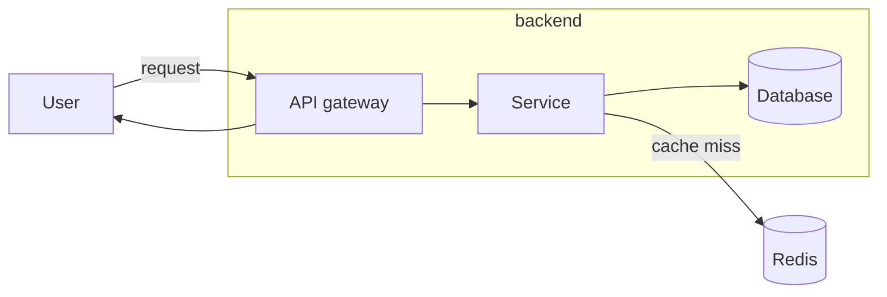
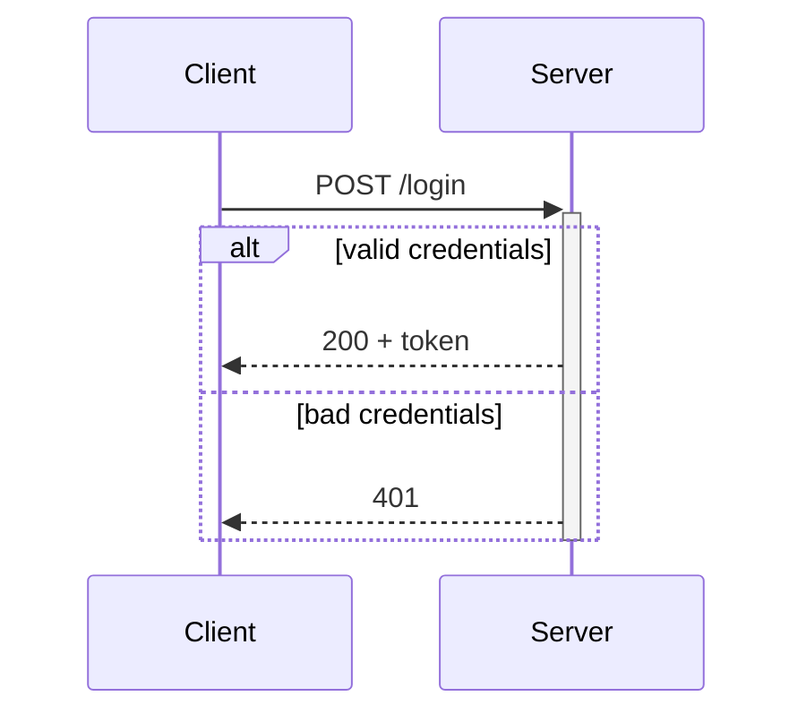
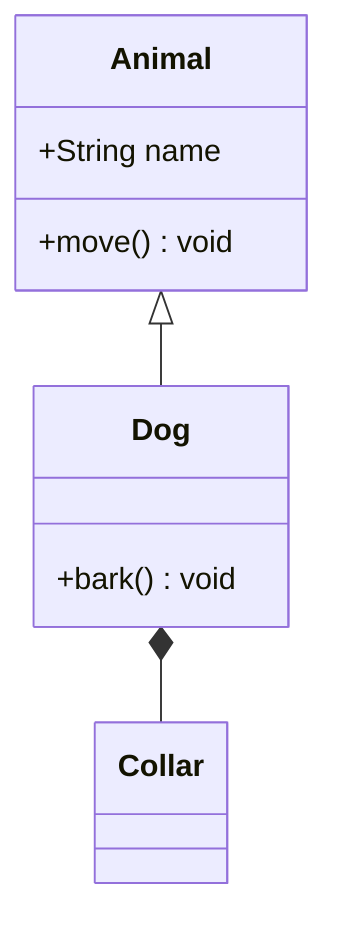
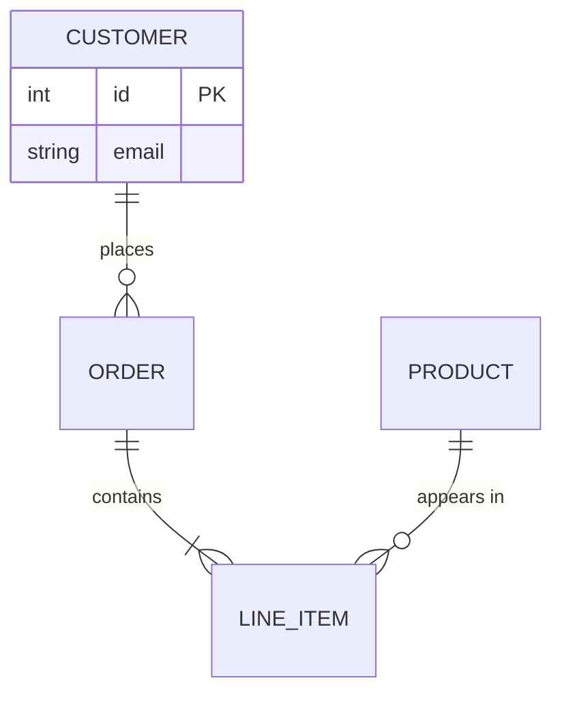
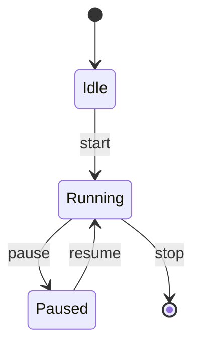

# mermaid — the zero-install diagram

Reach for Mermaid when the diagram has to **just show up** — in a README, a PR description, an
issue, a design doc — with no tooling on the reader's side. You write a fenced ` ```mermaid ` block
inside any `.md` file; GitHub renders it natively on push, and VS Code renders it in the built-in
Markdown preview (the Markdown Preview Mermaid extension covers older versions). No install, no
browser, no build step, no image to regenerate. That portability is the whole point — pick Mermaid
when getting the picture in front of someone beats rich layout or click-through drill-down.

## The five diagram types

Each block below is correct Mermaid that renders as-is. Pick the type by what the diagram is *about*:
control/data flow, an interaction over time, code structure, data schema, or a lifecycle.

**`flowchart` — boxes and arrows.** Steps, decisions, data flow, layered pictures. Set direction
(`TD` top-down, `LR` left-right); group with `subgraph`; label edges so an arrow means something.



**`sequenceDiagram` — who talks to whom, in order.** Participants across the top, time down the
page. `->>` is a call, `-->>` a reply; `activate`/`deactivate` (or `+`/`-`) show lifelines; `alt`
/`opt`/`loop` show branches.



**`classDiagram` — types and their relations.** Fields, methods, and how classes connect.
`<|--` inheritance, `*--` composition, `o--` aggregation, `-->` association.



**`erDiagram` — data schema.** Entities and cardinality. `||--o{` = one-to-many; `}o--o{` =
many-to-many; `||--||` = one-to-one.



**`stateDiagram-v2` — a lifecycle.** States and the transitions between them; `[*]` is the
start/end pseudostate.



## Honesty about scope

Mermaid ships experimental `C4Context` and `architecture-beta` types, but they are unstable and
degrade badly on non-trivial graphs — cramped layout, overlapping labels, breaking changes between
versions. Do not lean on them for real work:

- **For genuine C4 architecture** (context → container → component drill-down), use the `likec4`
  skill instead — it is built for exactly that.
- **For a layered / grouped picture here**, don't reach for `architecture-beta` — use a plain
  `flowchart` with styled `subgraph`s. It renders everywhere and you control the layout.

## Idioms for diagrams that read well

- **Set the direction on purpose.** `LR` for pipelines and sequences of steps, `TD` for hierarchies
  and decision trees.
- **Group with `subgraph`.** It signals a boundary (a service, a layer, a module) and pulls related
  nodes together.
- **Label every edge that isn't obvious.** `A -->|on failure| B` beats a bare arrow — the label is
  where the meaning lives.
- **Cap nodes per view.** Past ~15–20 nodes a diagram stops communicating. Split a busy picture into
  several focused diagrams (one per flow, one per layer) rather than one wall of boxes.
- **Style sparingly with `classDef` + `class`** to draw the eye, not to decorate:

  ```mermaid
  flowchart TD
      A[normal] --> B[hot path]
      classDef hot fill:#f96,stroke:#900,color:#fff
      class B hot
  ```

## Viewing and degradation

Save diagrams as fenced ` ```mermaid ` blocks directly inside `.md` files. They render on push to
GitHub and in the VS Code Markdown preview — no export, no separate image to keep in sync with the
text. **No degradation path is needed:** Mermaid *is* the baseline other diagram formats fall back
to when portability matters.
