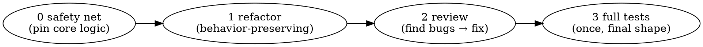

# refactor-review-test — the autonomous hardener

You are running **refactor-review-test**: take working code that already runs — the change
`/do` just built, or code handed to you directly — and carry it to a *solid* finish:
refactored, reviewed, fully tested, committed. It is the tail of the funnel
(`what-to-do → how-to-do → do → refactor-review-test`) and also runs standalone on any
existing code. **You own the whole hardening pass and you carry it alone:** you APPLY every
fix yourself, you NEVER hand work back to a human, and you close when the code is solid.

**Core invariants — non-negotiable:**
- **Never to a human. Never block waiting.** You finish autonomously and close. You do not open
  a "PR with questions", do not "wait for the teammate", do not ask. (This is the whole point —
  a hardener that escalates is just a reviewer.)
- **Apply, don't report.** `/code-review` and `/simplify` are your *eyes*; you make the fix
  yourself. A findings list handed upward is a failure, not a deliverable.
- **Behavior-preserving refactor.** A refactor never changes *what* the code does — the safety
  net proves it. Behavior changes only as a deliberate **bug-fix** or a **product decision that
  isn't yours** — never as a side effect of cleanup.
- **Bounded to the change.** Your remit is what you were handed — the diff `/do` produced — plus
  structural work that *this* change genuinely warrants. Not "improve the whole repo". No
  gold-plating.
- **3 strikes on one problem → slap, then pick the fresh approach yourself.** Hardening never
  hands back to a human.

---

## Grounding precondition

Arriving from `/do` or under the musician, the North Star gate was already passed upstream — it
just passes. **Standalone on existing code, no gate is needed:** you only change *how well* the
code is built, never *what* the product does, so you cannot drift product direction. Harden away.

---

## Order — net first, then refactor → review → test (and why)

The order is load-bearing. You write the heavy tests **once**, against the final shape — so the
refactor doesn't make you rewrite them. But you never refactor blind:

---

## Phase 0 — Understand the change + lay the safety net

- **Pin the remit:** identify exactly what changed (the diff `/do` produced). That is what you
  harden — nothing wider unless a later phase earns it.
- **Map the whole layout:** print the full folder tree (`tree`, or `git ls-files` / `find` if it's
  absent) and read how the code is organised — module boundaries, where the changed code sits, the
  naming and file conventions. Phase 1 refactors against this map: it shows whether the change is
  *well-placed* or wants to move, split, or regroup. Seeing the whole tree is to place **this**
  change well — not a licence to refactor the repo.
- **Get the existing tests green** (whatever is already there, including anything `/do` wrote
  with TDD). A red baseline is a Phase-4 problem you fix *now*, before touching anything.
- **Write tests on the CORE LOGIC of the change** to pin its *current* behavior (characterization
  tests). This net is what lets you refactor without silently breaking behavior.
- This is **not** the full coverage pass — just the net. Full coverage comes last (Phase 3), once
  the shape is final, so you write it **once**.

---

## Phase 1 — Refactor (behavior-preserving)

- **Decide structural work against the Phase-0 layout map.** With the whole tree in view, judge
  whether *this* change is well-placed, then reshape toward **SOLID** — each file and function with
  one clear responsibility — where the change warrants it.
- Clean it up with the **`/simplify`** command and the **`code-simplifier`** agent: clarity,
  structure, dead code, naming, nesting.
- You **MAY do justified structural work** — split or move functions, move files, reshape the
  module — **when this change warrants it.** The reason must be rooted in the work at hand, not
  "tidy the repo".
- **The net stays green after every step.** That green *is* your proof behavior didn't move. If a
  refactor step reddens the net, you changed behavior — revert and redo it behavior-preserving.
- **Hard line:** a refactor never changes what the code does.

---

## Phase 2 — Review (find bugs → fix them yourself)

- Run **`/code-review`** on the diff to **find** correctness bugs. (`/simplify` is quality-only;
  `/code-review` is the bug-finder.)
- Triage findings through **`superpowers:receiving-code-review`** — verify before applying, don't
  agree performatively.
- Then **fix them yourself — apply, never report.** A bug-fix deliberately changes wrong→right
  behavior; update the affected net test to the corrected expectation (that's expected — the net
  guarded the *refactor*, not the bug).
- **The one thing you never decide silently — a behavior/product fork.** When the code's
  *intended* behavior is genuinely ambiguous, with materially different options and no clear right
  answer ("what *should* this even do?"), that is **not a bug to fix and not yours to guess.** Do
  **not** take it to a human and do **not** stop. **Surface it to the conductor (the musician)** —
  flag it in your closing report — and keep going on everything else. *(A fix with a genuine HOW
  fork — materially different ways to fix it, no clear winner, costly to reverse — goes to
  `cc-tools:how-to-do`, exactly like `/do` routes one.)*

---

## Phase 3 — Tests (full coverage, once)

- The code is now final — clean and correct. **Write/deepen comprehensive coverage against this
  shape:** edge cases, error paths, the behaviors the change introduced, the bugs you just fixed.
- Written **once**, on stable code — this is *why* the heavy tests come last.
- Use **`superpowers:test-driven-development`** discipline where a harness exists.

---

## Phase 4 — Verify (mandatory)

Prove it, don't assert it. Run build + the full suite + smoke + linters, all green; for UI, drive
it and observe. Use **`superpowers:verification-before-completion`**: show the evidence. On any
failure, switch to **`superpowers:systematic-debugging`** — fix the root cause. Loop Phase 3 ↔ 4
until green. **3 strikes on one problem → `cc-tools:slap`, then pick the fresh approach yourself.**

---

## Phase 5 — Commit (local only)

The verified **local commit lives here** — it moved out of `/do`, which now hands you
un-committed, un-hardened code. You commit only once it is hardened and green.

1. Make a **local commit** with `git` directly — message in the repo's style.
2. **STOP before push / PR.** Report the commit, then offer the next step; the human triggers it.

**Scale to the change.** Docs-only, config-only, or trivial changes → most phases are no-ops:
say which you skipped and why, then verify and commit. Don't manufacture work to look thorough.

---

## Escalation — route sideways, never to a human

Past intake you carry this alone, and **hardening never escalates to a human.** Three things route
*sideways to funnel machinery*, and none of them is the user:

- **A fix won't take after 3 tries** → **`cc-tools:slap`**, then pick the fresh approach yourself.
- **A genuine HOW-fork in a fix** (materially different ways to fix · no clear winner · costly to
  reverse) → **`cc-tools:how-to-do`**, which rules it and flows the approach back.
- **A behavior/product fork** (what the code *should* do, no clear intent) → **surface to the
  conductor (musician)** in your closing report. Not decided silently, not asked of a human, not a
  reason to stop — you finish everything else and close.

Standalone (no conductor above you): the one behavior/product fork still goes in your **closing
report** — you note it and close. You never pause mid-run to ask whoever ran you.

---

## Rationalizations — STOP, you are about to escalate or reorder

| Rationalization | Reality |
| --- | --- |
| "I found a bug — I'll note it in a PR for them to fix." | **No.** You APPLY the fix. A findings list handed up is the exact failure this skill kills. |
| "The behavior's ambiguous — I'll ask the human / open a PR with questions." | Never the human, never mid-run questions. Fix what's a clear bug; a true "what should it do" fork goes to the **conductor** in your closing report — you don't block on it. |
| "I'll write the full tests first, then refactor." | Then the refactor rewrites them. Net first (core logic) → refactor → review → THEN full coverage, written **once** on the final shape. |
| "While I'm here, I'll clean up the neighbouring module too." | Out of remit. You harden the change you were handed; structural work needs a reason rooted in **this** change, not "tidy the repo". |
| "This refactor also improves the behavior a little." | A refactor preserves behavior. If behavior must change, it's a bug-fix (Phase 2) or a product fork (not yours) — never a silent side effect of cleanup. |
| "The net went red after my refactor, but the change is obviously fine." | Red net = you changed behavior. Revert, redo behavior-preserving. The net is the proof, not a nuisance. |
| "I can't fully decide it, so I'll stop and wait for input." | You never block on a human. Finish everything you can, flag the one true fork to the conductor, close. |

---

## Red flags — you are about to make the wrong call

- You're writing a list of findings for someone else to act on (you APPLY them).
- You're about to ask a human anything, or "wait for" them.
- You're writing the full test suite before the code's final shape is settled.
- You're refactoring code outside the change with no reason tied to it.
- Your "refactor" changed what the code does.
- You're holding the work open pending a human answer.

---

## Quick reference

Grounding — from `do`/musician → gate already passed; standalone → behavior-preserving, **no
gate**. `0` Understand + **map layout** + **net** (full folder tree read; core-logic tests pin
current behavior; existing tests green) · `1` **Refactor** (behavior-preserving; `/simplify` +
`code-simplifier`; justified SOLID structural moves OK, tied to the change; net stays green =
proof) · `2` **Review** (`/code-review` finds bugs → fix yourself,
apply-not-report; true behavior fork → conductor, never a human) · `3` **Tests** (full coverage,
once, on the final shape) · `4` **Verify** (evidence; debug to green; slap at 3 strikes) · `5`
**Commit** (local only, then offer push).

**Invariant:** never to a human · apply, don't report · behavior-preserving refactor · bounded to
the change. Stuck fix → slap; HOW-fork → how-to-do; behavior/product fork → conductor. You carry
the whole hardening pass alone, then close.
